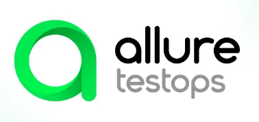

## Привет 👋
### Меня зовут Анна, я QA инженер 

## Стек и инструменты

  <code></code>
  <code></code>
  <code></code>
  <code></code>
  <code></code>
  <code></code>
  <code></code>
  <code></code>
  <code></code>

---------------

### 🔗 Тестовый проект c UI тестами: [demoqa_tests_selene](https://github.com/VishnyaAnna/demoqa_tests_selene/tree/jenkins)

✔️ Реализованы автотесты UI на сайт DEMOQA 

#### В проекте используется:

 - Page Object
 - Инкапсуляция
 - Интеграция с Allure report
 - Интеграция с Jenkins

----------
### 🔗 Тестовый проект c API тестами: [reqres_in_api](https://github.com/VishnyaAnna/reqres_in_api)

✔️ Реализованы автотесты Rest API на reqres.in 

#### В проекте используется:

 - Шаблоны форматирования логов запросов
 - Управление конфигом через pytest
 - Интеграция с Allure report
 - Интеграция с Jenkins
 - Интеграция с Allure testops

